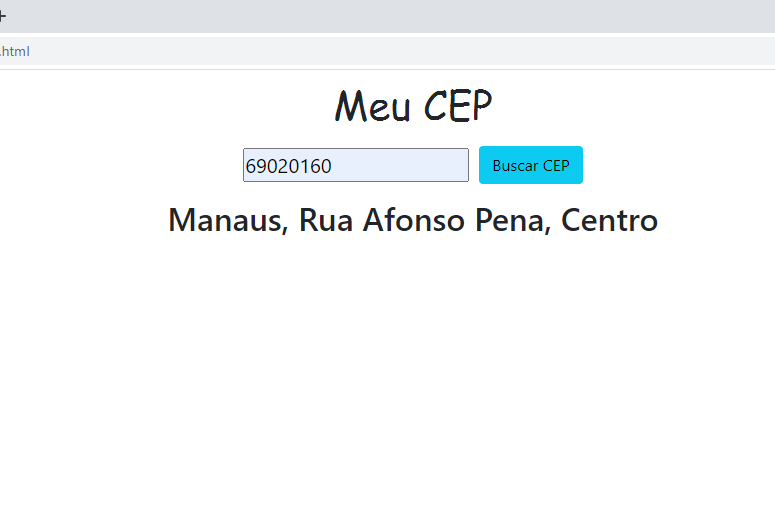

# consulta-cep
Sistema consulta CEP, feito exclusivamente com JQuery, HTML5, CSS3.

</img>

Sistema simples onde o usuário digita um CEP e ao clicar no botão é exibido a cidade a rua e o bairro.

 Depois que o usuário clica no botão é acionado uma função no Jquery que conecta a API  https://viacep.com.br/ e é retornado uma dicionário de dados, depois ocorre um tratamento de dados e é retornado ao usuário somente os dados requiridos. 

## Tecnologias 

Jquery

Ajax

Css

Html

